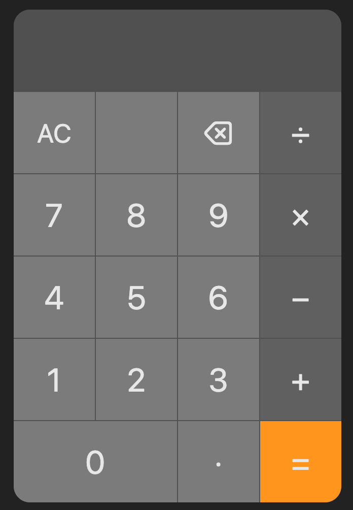

# Calculator

A clean, iOS-inspired calculator built with vanilla HTML, CSS, and JavaScript.

🔗 **[Live Demo](https://khunz.github.io/html-calc/)**

## Features

- Addition, subtraction, multiplication, and division
- Decimal support with duplicate decimal prevention
- Backspace to undo last input
- AC button to fully reset the calculator
- Overflow protection — prevents excessively long inputs and results
- Error handling for invalid operations (division by zero, empty input)
- Full keyboard support (`0-9`, `+`, `-`, `*`, `/`, `.`, `Enter`, `Backspace`, `Escape`)

## Built With

- HTML
- CSS
- JavaScript (vanilla, no libraries)
